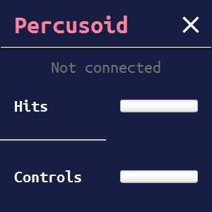

# PercusoidDesktopServer
Kotlin desktop application that provides communication between Percusoid android app and any MIDI input software

As you can see I'm a god of design:

_I hope you are okay after you've just seen_

- This application uses [JavaOSC](https://github.com/hoijui/JavaOSC) library to make a connection with [Percusoid](https://github.com/Apisov/Percusoid) Android app.
- For converting OSC messages to MIDI has been used modified [The MidiBus](https://github.com/Apisov/themidibus)

If you want to make application that serves as MIDI output you need a virtual MIDI port. For that purpose I've used [LoopMIDI](https://www.tobias-erichsen.de/software/loopmidi.html)

For now there is hardcoded name for the virtual MIDI port - `Virtual MIDI Bus`. 
**Thus you have to create a virtual midi port with the exact same name.**

_General instructions of using the Android app and this desktop app can be found [here](https://github.com/Apisov/Percusoid#instruction-for-the-app)_

_TODO:_
- [ ] Midi output name configuration in GUI
